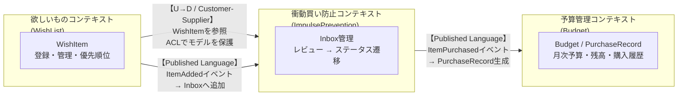
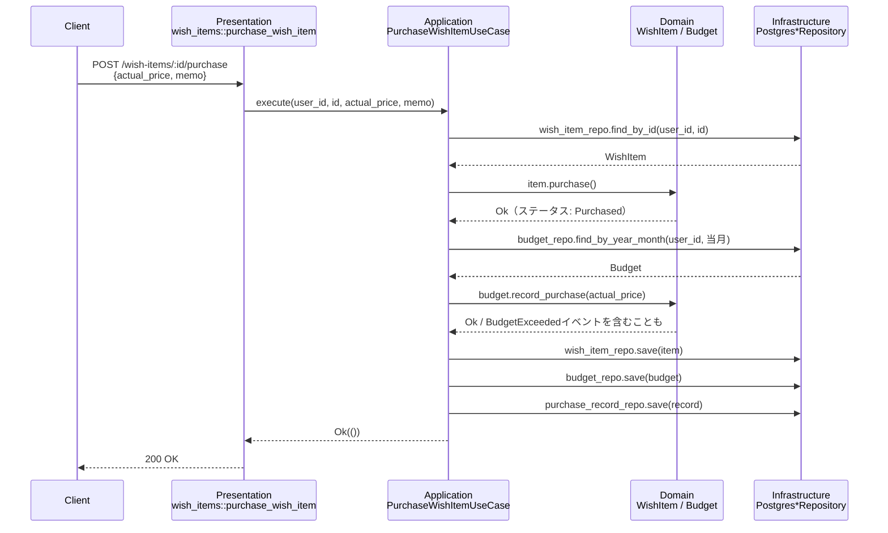

# hoshika（ホシカ）

> 自由に使えるお金の中で、何を・いつ・どの順番で買うかを決めるアプリ

「欲しいか？」を立ち止まって考えるための、欲しいものリスト × 予算管理アプリ。

---

## ドキュメント

| ドキュメント | 内容 |
|---|---|
| [DEVELOPMENT.md](./DEVELOPMENT.md) | 開発環境のセットアップ・動作確認・トラブルシューティング |
| [TASKS.md](./TASKS.md) | 現在の進捗（Active なタスク・完了記録） |
| [hoshika-roadmap.md](./hoshika-roadmap.md) | 全フェーズのロードマップ・学習リソース |

このREADMEは、ドメインモデル・設計思想のリファレンスとして書かれている。動かし方は [DEVELOPMENT.md](./DEVELOPMENT.md) を参照。

---

## Glossary（ユビキタス言語）

このプロジェクトで使う言葉を統一する。コード・会話・ドキュメントすべてでこの用語を使う。

### エンティティ（IDで追跡されるもの）

| 用語 | 日本語での呼び方 | 定義 |
|------|----------------|------|
| `WishItem` | 欲しいもの | 欲しいものリストに登録された1件のアイテム。名前・価格・カテゴリ・登録日を持つ。IDで同一性を追跡する |
| `Budget` | 予算 | 月次の使用可能金額。月・金額・残高を持つ。IDで追跡される |
| `PurchaseRecord` | 購入記録 | WishItemを購入した際に生成される記録。購入日・実際に支払った金額・WishItemへの参照・メモを持つ。WishItemの希望価格と実支払額が異なる場合（セールなど）があるため独立したエンティティとして持つ |

### 値オブジェクト（値で比較されるもの）

| 用語 | 日本語での呼び方 | 定義 |
|------|----------------|------|
| `Price` | 金額 | 0円以上の正の値。負の値は存在しない |
| `Balance` | 残高 | 予算の残高。負になりうる（予算超過はドメイン上ありえる状態）。`is_exceeded()` / `is_sufficient_for()` / `deduct()` でドメイン意図を表現する |
| `Category` | カテゴリ | アイテムの分類（例: 書籍・ガジェット・ファッション）。文字列ではなく型として扱う |
| `WishItemName` | 欲しいものの名前 | 空文字列不可のドメインルールを型で表現する。`new()` でバリデーション済みの値のみ生成できる |
| `WishItemStatus` | 欲しいものの状態 | `Inbox`（未整理）・`NextToBuy`（次に買う）・`OnHold`（保留）・`Archived`（不要・非表示）・`Purchased`（購入済み）のいずれか |
| `Memo` | メモ | WishItem・PurchaseRecord に添付できる自由記述。空でも可 |
| `YearMonth` | 年月 | 予算管理の月単位を表す。2000年以降・1〜12月のバリデーションあり |

### ドメインサービス

| 用語 | 日本語での呼び方 | 定義 |
|------|----------------|------|
| `BudgetService` | 予算サービス | 購入時に予算残高を確認し、超過する場合は`BudgetExceeded`を発生させる。複数集約をまたぐためドメインサービスとして定義 |

### ドメインイベント（何が起きたか）

| イベント名 | 発生条件 |
|------------|----------|
| `ItemAdded` | WishItemがInboxに追加された |
| `ItemReviewed` | ユーザーがレビューし、ステータスを変更した（次に買う／保留） |
| `ItemMovedToNextToBuy` | OnHold状態のWishItemが「次に買う」に昇格した |
| `ItemArchived` | WishItemが「不要」と判断され、アーカイブされた |
| `ItemPurchased` | WishItemが購入済みになった |
| `BudgetSet` | 月次予算が設定された |
| `PurchaseRecorded` | 購入が予算に記録され、残高が減少した |
| `BudgetExceeded` | 購入によって予算残高が0を下回った |

---

## 衝動買い防止のドメインルール

このアプリの核心となるビジネスルール。

```
WishItemを登録した瞬間（ItemAdded）
    ↓
WishItemStatus: Inbox（未整理）
    ↓  ← この間は「まだ買えない」状態
ユーザーが能動的にリストをレビューする（ItemReviewed）
    ├─ 次に買う → WishItemStatus: NextToBuy → 購入可能になる
    ├─ 保留     → WishItemStatus: OnHold    → 引き続きリストに残る
    └─ 不要     → WishItemStatus: Archived  → 非表示（履歴として保持）
```

**なぜこのルールか**: 衝動買いを防ぐのはシステムのタイマーではなく、**「リストを見直す」という行為そのもの**。登録した瞬間は買えない（Inbox）状態にすることで、必ず一度立ち止まらせる。その上でユーザー自身が「本当に欲しいか」を判断する。アーカイブは削除ではなく履歴として残し、「あのとき買わなくて正解だった」が振り返れる。

---

## バウンデッドコンテキスト

| コンテキスト | 責務 | 主なエンティティ |
|-------------|------|-----------------|
| **欲しいものコンテキスト** (WishList) | アイテムの登録・優先順位・ステータス管理 | `WishItem` |
| **予算管理コンテキスト** (Budget) | 月次予算・残高・購入記録・月次履歴ビュー | `Budget`, `PurchaseRecord` |
| **衝動買い防止コンテキスト** (ImpulsePrevention) | Inboxの管理・レビューによるステータス遷移 | `WishItem`（ステータス遷移） |

### コンテキストマップ

3つのコンテキスト間の関係と統合パターン。



**統合パターンの説明:**

| 関係 | パターン | 理由 |
|------|---------|------|
| WishList → ImpulsePrevention | **Customer-Supplier + ACL** | WishListが上流（WishItemを所有）。ImpulsePrevention側はACLでWishListのモデルに引きずられないよう保護 |
| WishList → ImpulsePrevention | **Published Language（ItemAdded）** | WishItem追加時にイベントを発行し、ImpulsePreventionがInboxへ取り込む |
| ImpulsePrevention → Budget | **Published Language（ItemPurchased）** | 購入確定時にイベントを発行し、Budgetがpurchase記録・残高更新を行う |

**設計上の判断:** WishItemのステータス（`WishItemStatus`）はImpulsePrevention文脈で定義するが、WishListコンテキストでも参照する。MVPではShared Kernelとして共有し、コンテキスト間の摩擦を最小化する。将来的にコンテキストが独立デプロイ単位になる場合は分離を検討する。

---

## 設計思想

このプロジェクトは **DDD（ドメイン駆動設計）** と **Clean Architecture** を組み合わせた設計を採用する。二つは補完関係にある。

| | 役割 | 問いかけ |
|---|---|---|
| **DDD** | 何をモデリングするか | 「このビジネスルールはどのオブジェクトが持つべきか？」 |
| **Clean Architecture** | どう層を分けるか | 「このコードはどのレイヤーに属するか？依存の方向は正しいか？」 |

### 依存の方向（最重要ルール）

```
Presentation（Axum handlers）
      ↓
Application（Use Cases）
      ↓
Domain（Entities / Value Objects / Repository traits）
      ↑
Infrastructure（SQLx / 外部API）
```

- **依存は常に内側（Domain）へ向かう**
- Domain層はRustの標準ライブラリのみに依存。AxumもSQLxも知らない
- Infrastructure層がDomain層のtraitをimplする（依存逆転の原則）

### レイヤーの責務

| レイヤー | 責務 | 持っていいもの |
|---|---|---|
| **Domain** | ビジネスルールとモデル | Entity, Value Object, Aggregate, Repository trait, Domain Event |
| **Application** | ユースケースの調整 | Use Case, Application Service, DTO |
| **Infrastructure** | 外部システムとの接続 | Repository impl（SQLx）, 外部APIクライアント |
| **Presentation** | HTTPの入出力 | Handler（薄いラッパーのみ）, Request/Response型 |

### リクエストの流れ（具体例: 購入を記録する）

抽象的な依存方向の図だけだと実感が湧きにくいため、実際のエンドポイント
`POST /wish-items/:id/purchase` を例に、1リクエストが各レイヤーをどう通過するかを示す。



**このフローから読み取れる依存の向き:**
- `PurchaseWishItemUseCase`（Application）は`WishItemRepository` / `BudgetRepository`という**Domain層で定義されたtrait**越しにしかInfrastructureを知らない。実装（Postgres版・InMemory版どちらか）はDIで注入される
- 予算超過の判定（`record_purchase`が返す`BudgetExceeded`イベント）はDomain層の責務。Presentation層はそれを見て何かを止めたりはしない（後述のトレードオフ参照）
- Handlerは`execute()`の結果をHTTPステータスに変換するだけで、ビジネスロジックを持たない

---

## 設計判断とトレードオフ

実装を進める中で下した、後から見て「なぜそうしたか」が自明ではない判断を記録する。
DB設計に閉じたトレードオフ（ENUM採用理由・balanceを都度計算しない理由など）は
[db-design.md](./db-design.md#設計上のトレードオフと判断)を参照。

### 予算超過はブロックしない、事後に可視化するだけ

`Budget.record_purchase()`は残高がマイナスになる購入も**許可**し、`BudgetExceeded`イベントを返すのみで
処理自体は止めない。フロントエンドは`BudgetMeter`の「予算超過」バッジで事後的に警告する。

**なぜ**: 「予算超過を確認ダイアログでブロックする」という実装も検討したが、それは
「衝動買い防止のドメインルール」（Inbox→レビュー→NextToBuyという回り道を強制する）とは別のレイヤーの話。
一度NextToBuyまでレビューを経た買い物を土壇場のダイアログで止めるのは、ドメインが既に許可した行動を
UIが横から覆すことになり一貫しない。「買ってよいかどうか」はレビューの時点で既に判断済み、という設計。

### 認可は「有効なJWTを持つか」の一点のみ（ユーザー間データ分離は別の粒度）

`require_auth`ミドルウェアは有効なJWTを検証するだけで、`wish_items`等の`user_id`列によるデータの絞り込みは
各リポジトリのクエリ（`WHERE user_id = $1`）に委ねている。「認証済みなら誰でも良い」わけではなく行を
跨いだアクセスはできないが、複数ユーザーが同じJWT発行エンドポイントを使える設計（`user_id`を渡せば誰でも
発行できる）である点は本番導入前に見直しが必要な既知の制約。

**なぜ**: 元々は認証・認可の機構が一切無く（誰でも全ユーザーのデータを読み書きできた）、これを
「有効なJWTが無ければ何もできない」状態にすることが最優先だった（[TASKS-phase05.md](./TASKS-phase05.md)の
セキュリティ確認で発見・修正）。真の認証（パスワード等によるログイン）とユーザー登録フローの実装は
アプリの利用シーンがまだ単一ユーザー（自分専用）である現段階ではスコープ外とし、"閂を閉める"ことを優先した。

### DomainEventは生成されるが、まだ誰も購読していない

`src/domain/events/`の`DomainEvent`列挙型はEntityのメソッド（`WishItem::add()`など）が確かに生成するが、
Application層のUse Caseは受け取った`events`をそのまま`_events`として握りつぶしている
（例: `add_wish_item.rs`）。イベントバスや購読者はまだ存在しない。

**なぜこのままにしているか**: 「起きたことを型で表現する」という設計自体は早期に固めておく価値がある
（テストでもイベントの発生を検証できる）一方、パブリッシュ先（ロギング・Sentryへの連携・将来の通知機能など）
が今のスコープに無いのに配線だけ先に作ると、動作確認できない配線が増えるだけになる。**「モデルとして存在する
ことに価値がある」フェーズと「実際に配線する」フェーズを分けている**、という意図的な未完成。

### Sentryに送るエラーはインフラ層由来のものだけに絞る

`src/presentation/handlers/mod.rs`の`internal_error()`は、各ハンドラーで個別に分類されなかった
「その他のエラー」だけを受け取ってSentryに送る。404（見つからない）・422（ドメインルール違反）は
各ハンドラーが個別に判定してSentryを経由させない。

**なぜ**: Sentryは「コードのバグ・インフラ障害」を知らせる場所であるべきで、「ユーザーが存在しないIDを
指定した」「予算未設定のまま購入しようとした」のようなドメイン上ありふれた出来事まで通知されると、
本当に見るべきアラートが埋もれる。アプリ層（想定内のエラー）とインフラ層（想定外のエラー）を
HTTPステータスコードの選択そのものに一致させ、実装を分岐させずに自然と分類されるようにした。

### インデックスは「足りないものを足す」だけでなく「実測して要らないものを消す」

`migrations/20260719000001_optimize_indexes.sql`では、20,000件規模の合成データで
`EXPLAIN ANALYZE`・`pg_stat_user_indexes`を使い、実際にどのクエリからも使われていないインデックスを
3つ削除した。逆に「効きそうな」複合インデックス（`wish_items(user_id, added_at)`）は追加を検討したが、
該当クエリにLIMITが無いため実行計画上のメリットが実測で確認できず、追加を**見送った**。

**なぜ**: 「インデックスを足す」ことだけが最適化ではない。使われないインデックスは書き込みのたびに
維持コストだけを払い続ける。「教科書的に良さそうな変更」を実測せずに入れることも、逆に必要な変更を
怠ることも同じくらい避けたい失敗として扱った（詳細は[TASKS-phase05.md](./TASKS-phase05.md)参照）。

---

## API エンドポイント

`src/presentation/router.rs` で定義されている現在のAPI。すべてのエラーレスポンスは `{"error": string}` 形式。
ローカル/CIではAPIはルート直下で動くが、本番（`STATIC_DIR`設定時）はフロントエンドの静的配信と同居するため
`/api` 配下にネストされる（例: `/wish-items` → `/api/wish-items`。詳細は[DEVELOPMENT.md](./DEVELOPMENT.md#デプロイflyio)）。

| メソッド | パス | 認証 | 概要 |
|---|---|---|---|
| `GET` | `/health` | 不要 | ヘルスチェック |
| `POST` | `/auth/token` | 不要 | `user_id` からJWTを発行（本番では認証後にのみ呼ぶ想定。現状は`user_id`を渡せば誰でも発行できる） |
| `GET` | `/auth/verify` | 不要 | `Authorization: Bearer <token>` を検証 |
| `GET` | `/wish-items` | 必須 | 欲しいもの一覧を取得（自分の`user_id`分のみ） |
| `POST` | `/wish-items` | 必須 | 欲しいものを追加（`Inbox` ステータスで登録） |
| `POST` | `/wish-items/:id/review` | 必須 | レビューしてステータス遷移（`still_want: true/false`） |
| `POST` | `/wish-items/:id/purchase` | 必須 | 購入済みにする（`actual_price`・`memo`を受け取り、当月予算から差し引く） |
| `GET` | `/categories` | 必須 | カテゴリ一覧を取得（欲しいもの追加時の選択肢） |
| `GET` | `/budgets/status?year=&month=` | 必須 | 指定年月の予算・残高・超過有無を取得 |
| `POST` | `/budgets` | 必須 | 指定年月の予算を新規作成/更新する |

「必須」のエンドポイントは`Authorization: Bearer <token>`が無い、または無効なら401を返す（`src/presentation/auth_middleware.rs`）。
フロントエンドからは `frontend/src/api/` 配下の関数（`wishItems.ts` / `budgets.ts` / `categories.ts` / `auth.ts`）経由でのみ呼び出す。

---

## 技術スタック

- **Backend**: Rust (Axum + SQLx)
- **Frontend**: React + TypeScript (Vite + TanStack Query)
- **DB**: PostgreSQL
- **Infra**: Fly.io
- **Architecture**: DDD + Clean Architecture

詳細な設計方針は [hoshika-roadmap.md](./hoshika-roadmap.md)、現在の進捗は [TASKS.md](./TASKS.md) を参照。
