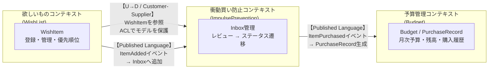

# hoshika（ホシカ）

> 自由に使えるお金の中で、何を・いつ・どの順番で買うかを決めるアプリ

「欲しいか？」を立ち止まって考えるための、欲しいものリスト × 予算管理アプリ。

---

## Glossary（ユビキタス言語）

このプロジェクトで使う言葉を統一する。コード・会話・ドキュメントすべてでこの用語を使う。

### エンティティ（IDで追跡されるもの）

| 用語 | 日本語での呼び方 | 定義 |
|------|----------------|------|
| `WishItem` | 欲しいもの | 欲しいものリストに登録された1件のアイテム。名前・価格・カテゴリ・登録日を持つ。IDで同一性を追跡する |
| `Budget` | 予算 | 月次の使用可能金額。月・金額・残高を持つ。IDで追跡される |
| `PurchaseRecord` | 購入記録 | WishItemを購入した際に生成される記録。購入日・実際に支払った金額・WishItemへの参照・メモを持つ。WishItemの希望価格と実支払額が異なる場合（セールなど）があるため独立したエンティティとして持つ |

### 値オブジェクト（値で比較されるもの）

| 用語 | 日本語での呼び方 | 定義 |
|------|----------------|------|
| `Price` | 金額 | 0円以上の正の値。負の値は存在しない |
| `Category` | カテゴリ | アイテムの分類（例: 書籍・ガジェット・ファッション）。文字列ではなく型として扱う |
| `WishItemStatus` | 欲しいものの状態 | `Inbox`（未整理）・`NextToBuy`（次に買う）・`OnHold`（保留）・`Archived`（不要・非表示）・`Purchased`（購入済み）のいずれか |
| `Memo` | メモ | 購入記録に添付できる自由記述。「セールで安く買えた」など。空でも可 |

### ドメインサービス

| 用語 | 日本語での呼び方 | 定義 |
|------|----------------|------|
| `BudgetService` | 予算サービス | 購入時に予算残高を確認し、超過する場合は`BudgetExceeded`を発生させる。複数集約をまたぐためドメインサービスとして定義 |

### ドメインイベント（何が起きたか）

| イベント名 | 発生条件 |
|------------|----------|
| `ItemAdded` | WishItemがInboxに追加された |
| `ItemReviewed` | ユーザーがレビューし、ステータスを変更した（次に買う／保留／不要） |
| `ItemArchived` | WishItemが「不要」と判断され、アーカイブされた |
| `ItemPurchased` | WishItemが購入され、PurchaseRecordが生成された |
| `BudgetExceeded` | 購入によって予算残高が0を下回った |

---

## 衝動買い防止のドメインルール

このアプリの核心となるビジネスルール。

```
WishItemを登録した瞬間（ItemAdded）
    ↓
WishItemStatus: Inbox（未整理）
    ↓  ← この間は「まだ買えない」状態
ユーザーが能動的にリストをレビューする（ItemReviewed）
    ├─ 次に買う → WishItemStatus: NextToBuy → 購入可能になる
    ├─ 保留     → WishItemStatus: OnHold    → 引き続きリストに残る
    └─ 不要     → WishItemStatus: Archived  → 非表示（履歴として保持）
```

**なぜこのルールか**: 衝動買いを防ぐのはシステムのタイマーではなく、**「リストを見直す」という行為そのもの**。登録した瞬間は買えない（Inbox）状態にすることで、必ず一度立ち止まらせる。その上でユーザー自身が「本当に欲しいか」を判断する。アーカイブは削除ではなく履歴として残し、「あのとき買わなくて正解だった」が振り返れる。

---

## バウンデッドコンテキスト

| コンテキスト | 責務 | 主なエンティティ |
|-------------|------|-----------------|
| **欲しいものコンテキスト** (WishList) | アイテムの登録・優先順位・ステータス管理 | `WishItem` |
| **予算管理コンテキスト** (Budget) | 月次予算・残高・購入記録・月次履歴ビュー | `Budget`, `PurchaseRecord` |
| **衝動買い防止コンテキスト** (ImpulsePrevention) | Inboxの管理・レビューによるステータス遷移 | `WishItem`（ステータス遷移） |

### コンテキストマップ

3つのコンテキスト間の関係と統合パターン。



**統合パターンの説明:**

| 関係 | パターン | 理由 |
|------|---------|------|
| WishList → ImpulsePrevention | **Customer-Supplier + ACL** | WishListが上流（WishItemを所有）。ImpulsePrevention側はACLでWishListのモデルに引きずられないよう保護 |
| WishList → ImpulsePrevention | **Published Language（ItemAdded）** | WishItem追加時にイベントを発行し、ImpulsePreventionがInboxへ取り込む |
| ImpulsePrevention → Budget | **Published Language（ItemPurchased）** | 購入確定時にイベントを発行し、Budgetがpurchase記録・残高更新を行う |

**設計上の判断:** WishItemのステータス（`WishItemStatus`）はImpulsePrevention文脈で定義するが、WishListコンテキストでも参照する。MVPではShared Kernelとして共有し、コンテキスト間の摩擦を最小化する。将来的にコンテキストが独立デプロイ単位になる場合は分離を検討する。

---

## 設計思想

このプロジェクトは **DDD（ドメイン駆動設計）** と **Clean Architecture** を組み合わせた設計を採用する。二つは補完関係にある。

| | 役割 | 問いかけ |
|---|---|---|
| **DDD** | 何をモデリングするか | 「このビジネスルールはどのオブジェクトが持つべきか？」 |
| **Clean Architecture** | どう層を分けるか | 「このコードはどのレイヤーに属するか？依存の方向は正しいか？」 |

### 依存の方向（最重要ルール）

```
Presentation（Axum handlers）
      ↓
Application（Use Cases）
      ↓
Domain（Entities / Value Objects / Repository traits）
      ↑
Infrastructure（SQLx / 外部API）
```

- **依存は常に内側（Domain）へ向かう**
- Domain層はRustの標準ライブラリのみに依存。AxumもSQLxも知らない
- Infrastructure層がDomain層のtraitをimplする（依存逆転の原則）

### レイヤーの責務

| レイヤー | 責務 | 持っていいもの |
|---|---|---|
| **Domain** | ビジネスルールとモデル | Entity, Value Object, Aggregate, Repository trait, Domain Event |
| **Application** | ユースケースの調整 | Use Case, Application Service, DTO |
| **Infrastructure** | 外部システムとの接続 | Repository impl（SQLx）, 外部APIクライアント |
| **Presentation** | HTTPの入出力 | Handler（薄いラッパーのみ）, Request/Response型 |

---

## 技術スタック

- **Backend**: Rust (Axum + SQLx)
- **Frontend**: React + TypeScript (Vite)
- **DB**: PostgreSQL
- **Infra**: Fly.io
- **Architecture**: DDD + Clean Architecture

詳細な設計方針は [hoshika-roadmap.md](./hoshika-roadmap.md) を参照。
