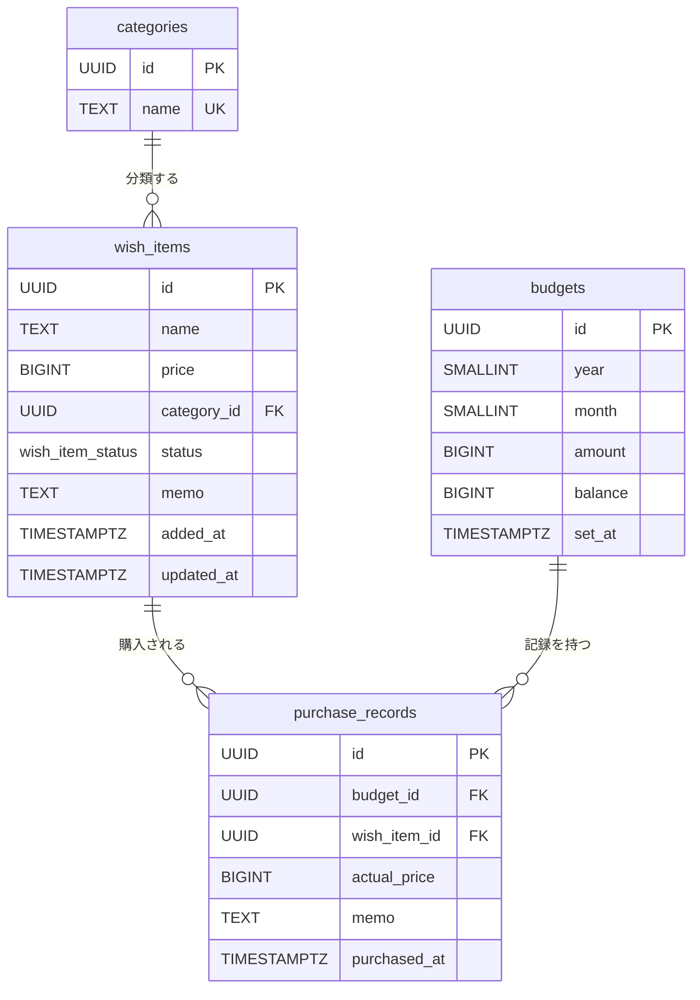

# DB設計

> Phase 01 成果物 — 2026-06-14  
> 対象読者: NoSQL（DynamoDB / MongoDB等）経験があり、PostgreSQLはこれから学ぶ方

ドメインモデル（[domain-model.md](./domain-model.md)）から導出したテーブル設計。

**原則: テーブルの都合でエンティティを歪めない。**  
ドメイン上の不変条件は、型・CHECK制約・アプリケーション層（Rustの型システム）で守る。

---

## NoSQLとの考え方の違い（最初に読む）

PostgreSQLのような**リレーショナルDB（RDB）**は、NoSQLとデータの持ち方が根本的に違います。

| | NoSQL（DynamoDB / MongoDB） | PostgreSQL（RDB） |
|---|---|---|
| データの単位 | ドキュメント（JSON的な構造） | 行（Row）と列（Column）の表 |
| スキーマ | 基本的に自由（後から列追加が楽） | 事前に型・制約を定義する |
| 関連データ | 1ドキュメントに埋め込むことが多い | 別テーブルに分けて外部キーで繋ぐ |
| 不変条件の担保 | アプリ側で書く | DBの制約（UNIQUE / CHECK / FK）で守れる |

RDBの強みは「**DBが嘘をつかない**」ことです。アプリ側のバリデーションが漏れても、DB制約が最後の砦になります。

---

## テーブル一覧

このアプリでは4つのテーブルを使います。  
NoSQLなら1コレクションに全部入れることもありますが、RDBでは「役割が違うデータは別テーブル」が基本です。

| テーブル名 | 対応するドメインオブジェクト | 所属コンテキスト |
|-----------|--------------------------|----------------|
| `categories` | `Category`（値オブジェクト） | WishList |
| `wish_items` | `WishItem`（集約ルート） | WishList |
| `budgets` | `Budget`（集約ルート） | Budget |
| `purchase_records` | `PurchaseRecord`（エンティティ） | Budget |

---

## PostgreSQLの基本概念（読み進める前に）

### PRIMARY KEY（主キー）

「このテーブルで行を一意に識別するID」です。  
DynamoDBの Partition Key に近い概念ですが、RDBでは全テーブルに必須です。  
このプロジェクトでは全テーブルで `UUID` を使います。

```sql
-- UUID を自動生成して主キーにする
id UUID PRIMARY KEY DEFAULT gen_random_uuid()
```

`gen_random_uuid()` はPostgreSQLの組み込み関数で、`uuid_generate_v4()` と同じ結果を返します。

### NOT NULL / DEFAULT

- `NOT NULL` — この列にNULLを入れることを禁止する制約
- `DEFAULT 値` — INSERTで値を省略したとき、自動で入る値

```sql
-- memo を省略してINSERTしたら、'' （空文字）が入る
memo TEXT NOT NULL DEFAULT ''
```

NoSQLでは「フィールドがない = undefined」でしたが、RDBでは「NULLか値かを明示する」設計になります。

### CHECK制約

「この列の値が条件を満たすこと」をDBが強制します。  
アプリ側でバリデーションしなくても、違反したINSERT/UPDATEはエラーになります。

```sql
price BIGINT NOT NULL CHECK (price >= 0)
-- → price に -1 を入れようとするとエラー
```

### FOREIGN KEY（外部キー）

「この列の値は、別テーブルのPKに存在する値だけ許可する」制約です。  
参照整合性を保証します。

```sql
category_id UUID NOT NULL REFERENCES categories(id)
-- → categoriesテーブルに存在しないUUIDを入れるとエラー
```

DynamoDBにはこの概念がなく、アプリ側で整合性を保つ必要がありました。  
RDBではDBが自動で「存在しない参照」を弾いてくれます。

### UNIQUE制約

「この列（または列の組み合わせ）は重複を許さない」制約です。

```sql
CONSTRAINT budgets_unique_year_month UNIQUE (year, month)
-- → 同じ年月のBudgetは1件しか作れない
```

### INDEX（インデックス）

「この列で検索することが多い」ときに作る、検索を速くする仕組みです。  
DynamoDBのGSI（グローバルセカンダリインデックス）に近い概念です。

```sql
CREATE INDEX idx_wish_items_status ON wish_items(status);
-- → status='Inbox' での絞り込みが速くなる
```

PRIMARY KEY には自動でインデックスが作られます。

---

## テーブル定義

### `categories`

`Category` 値オブジェクトの永続化。`wish_items` より先に定義します（後述のFKで参照されるため）。

```sql
CREATE TABLE categories (
    id   UUID        PRIMARY KEY DEFAULT gen_random_uuid(),
    name TEXT        NOT NULL UNIQUE CHECK (name <> '')
    --   ↑ 型         ↑ NULLなし  ↑ 重複なし ↑ 空文字禁止
);

-- 初期データ（ユーザーが後から追加・変更可能）
INSERT INTO categories (id, name) VALUES
    (gen_random_uuid(), '書籍'),
    (gen_random_uuid(), 'ガジェット'),
    (gen_random_uuid(), 'ファッション'),
    (gen_random_uuid(), 'その他');
```

**設計判断:**
- `Category` を別テーブルにしたのは、ユーザーが自由にカテゴリを追加・変更できるようにするため。NoSQLなら `wish_items` ドキュメントに `categoryName: "書籍"` と埋め込む方法もありますが、そうすると「カテゴリ名を変更したとき全件更新が必要」になります。
- `name <> ''` の CHECK で「空カテゴリ名禁止」というドメインルールを DB レベルでも担保します。

---

### `wish_items`

`WishItem` 集約ルートの永続化。`Price` / `WishItemStatus` / `Memo` は列に直接埋め込みます（小さな値オブジェクトは別テーブルにしない）。

```sql
-- PostgreSQL独自の ENUM 型を定義する
-- 「この値のどれかしか入れられない」という型
CREATE TYPE wish_item_status AS ENUM (
    'Inbox',       -- 追加したばかり（まだレビューしていない）
    'NextToBuy',   -- 次に買う候補
    'OnHold',      -- 一時保留
    'Archived',    -- アーカイブ（候補から外れた）
    'Purchased'    -- 購入済み
);

CREATE TABLE wish_items (
    id          UUID              PRIMARY KEY DEFAULT gen_random_uuid(),
    name        TEXT              NOT NULL CHECK (name <> ''),
    price       BIGINT            NOT NULL CHECK (price >= 0),
    --          ↑ 円単位の整数。日本円に小数は不要なので BIGINT で十分
    category_id UUID              NOT NULL REFERENCES categories(id),
    --          ↑ categories テーブルの id を参照する外部キー
    status      wish_item_status  NOT NULL DEFAULT 'Inbox',
    --          ↑ 上で定義したENUM型。「Inbox以外のステータスで作成する」ことが不可能になる
    memo        TEXT CHECK (memo IS NULL OR memo <> ''),
    --          ↑ NULL = メモなし。空文字禁止（Rust側で Option<String> の Some は必ず非空文字列）
    added_at    TIMESTAMPTZ       NOT NULL DEFAULT now(),
    --          ↑ TIMESTAMPTZ = タイムゾーン付きの日時型。now() で現在時刻が入る
    updated_at  TIMESTAMPTZ       NOT NULL DEFAULT now()
);
```

#### updated_at を自動更新するトリガー

RDBには**トリガー**という仕組みがあります。「UPDATEが起きたとき自動で実行する処理」を登録できます。

```sql
-- トリガー関数を定義（実行する処理の中身）
CREATE OR REPLACE FUNCTION set_updated_at()
RETURNS TRIGGER AS $$
BEGIN
    NEW.updated_at = now();  -- 更新後の行の updated_at を現在時刻にする
    RETURN NEW;
END;
$$ LANGUAGE plpgsql;

-- トリガーを wish_items に紐付ける
CREATE TRIGGER wish_items_updated_at
    BEFORE UPDATE ON wish_items          -- wish_items への UPDATE の前に
    FOR EACH ROW EXECUTE FUNCTION set_updated_at();  -- 1行ずつ実行
```

これで「アプリ側で `updated_at = now()` を書かなくても自動で更新される」ようになります。

**設計判断まとめ:**

| 項目 | 判断 | 理由 |
|------|------|------|
| `price` の型 | `BIGINT`（円単位の整数） | 日本円は小数を持たないため `DECIMAL` / `NUMERIC` 不要 |
| `status` の型 | PostgreSQL `ENUM` | 許可外のステータスは DB レベルで弾く。Rustの `enum WishItemStatus` と対称性を持たせる |
| `memo` の NULL | NULL 許容 + 空文字禁止（`Option<String>`） | メモは任意項目。`None` = なし、`Some(s)` は必ず非空文字列。`CHECK (memo IS NULL OR memo <> '')` でDBも担保 |
| `status` の初期値 | `DEFAULT 'Inbox'` | 「新規作成時は必ず Inbox」という不変条件をDBでも担保 |
| ステータス遷移ルール | CHECK制約では表現できないのでアプリ層で担保 | `Inbox → NextToBuy` のような「前の値に依存する遷移」はDBのCHECK制約では書けない |

**インデックス:**

```sql
-- 一覧取得時に status でフィルタする（最も頻繁なクエリパターン）
CREATE INDEX idx_wish_items_status ON wish_items(status);

-- カテゴリ別絞り込み
CREATE INDEX idx_wish_items_category_id ON wish_items(category_id);
```

---

### `budgets`

`Budget` 集約ルートの永続化。ドメインの `YearMonth` 値オブジェクトを `year` / `month` の2列に分解して格納します。

```sql
CREATE TABLE budgets (
    id        UUID        PRIMARY KEY DEFAULT gen_random_uuid(),
    year      SMALLINT    NOT NULL CHECK (year >= 2000),
    --        ↑ SMALLINT = 小さい整数型（-32768〜32767）。年月は BIGINT ほど大きくならない
    month     SMALLINT    NOT NULL CHECK (month BETWEEN 1 AND 12),
    amount    BIGINT      NOT NULL CHECK (amount > 0),
    balance   BIGINT      NOT NULL,
    --        ↑ あえて CHECK (balance >= 0) をつけない（後述）
    set_at    TIMESTAMPTZ NOT NULL DEFAULT now(),

    CONSTRAINT budgets_unique_year_month UNIQUE (year, month)
    -- ↑ 「同じ年月のBudgetは1件だけ」という不変条件
);
```

**設計判断まとめ:**

| 項目 | 判断 | 理由 |
|------|------|------|
| `YearMonth` の格納方法 | `year` + `month` の整数列に分解 | `DATE型`（2026-06-01）にすると「日」の概念が混入する。ドメインの「月」という単位を直接表現する |
| `balance` の負値を許容 | `CHECK (balance >= 0)` を**あえて付けない** | 「残高は負になりうる」はドメインルール。予算超過を `BudgetExceeded` イベントで通知する設計のため |
| `amount` の最小値 | `amount > 0`（0より大きい） | 「予算金額は0円より大きい」という不変条件 |
| 月ユニーク制約 | `UNIQUE (year, month)` | 「同一月に Budget は1件のみ」という不変条件をDBで担保 |

---

### `purchase_records`

`PurchaseRecord` エンティティの永続化。`Budget` 集約の内部エンティティのため、`budget_id` で親 `Budget` を参照します。

```sql
CREATE TABLE purchase_records (
    id            UUID        PRIMARY KEY DEFAULT gen_random_uuid(),
    budget_id     UUID        NOT NULL REFERENCES budgets(id),
    --            ↑ どの月の予算に対する購入か
    wish_item_id  UUID        NOT NULL REFERENCES wish_items(id),
    --            ↑ どの WishItem を買ったか
    actual_price  BIGINT      NOT NULL CHECK (actual_price >= 0),
    --            ↑ wish_items.price（希望価格）とは別の列！実際に払った金額
    memo          TEXT CHECK (memo IS NULL OR memo <> ''),
    --            ↑ NULL = メモなし。wish_items.memo と同じ方針（空文字禁止）
    purchased_at  TIMESTAMPTZ NOT NULL DEFAULT now()
);
```

**なぜ `wish_items.price` と `actual_price` を別にするか:**  
希望価格（登録時）と実支払額（購入時）は違うことがあります（タイムセール、クーポン等）。この差を記録できることが `PurchaseRecord` を独立エンティティにした理由です。

**インデックス:**

```sql
-- 予算別の購入記録一覧（月次集計クエリで使用）
CREATE INDEX idx_purchase_records_budget_id ON purchase_records(budget_id);

-- WishItem の購入履歴検索
CREATE INDEX idx_purchase_records_wish_item_id ON purchase_records(wish_item_id);
```

---

## マイグレーション順序

RDBでは外部キーの参照先が先に存在していないとテーブルを作れません。  
（DynamoDBにはこの概念がないため、順序を気にする必要はありませんでした）

```
1. categories        ← 他のテーブルから参照されるので最初に作る
2. wish_items        → categories を参照
3. budgets           ← purchase_records から参照されるので先に作る
4. purchase_records  → budgets と wish_items の両方を参照
```

---

## ER図

テーブル間の関係を図にすると以下のようになります。  
`||--o{` は「1対多」（1つのcategoryに対して複数のwish_itemがある）を意味します。



---

## 設計上のトレードオフと判断

### ドメインイベントをテーブルに持たない理由

`ItemAdded` / `ItemPurchased` / `BudgetExceeded` などのドメインイベントは、MVPでは**アプリケーション層でのみ発行・処理**します。  
イベント履歴をDBに永続化する「イベントソーシング」という設計パターンもありますが、複雑になるため Phase 02 以降の検討事項とします。

### `wish_item_status` に PostgreSQL ENUM を使う理由

- Rust の `enum WishItemStatus` と対称性を持たせて、コードとDBを読み比べやすくする
- 許可外の値の挿入を DB レベルで弾く（アプリのバグで変なステータスが入るのを防ぐ）
- **欠点**: ENUMのバリアント追加・変更には `ALTER TYPE` が必要で、しかもPostgreSQLでは**トランザクション内で実行できない**（他のDDLとは異なる制限）
- ステータスが増える見込みがない設計なので許容する

### `balance` を `purchase_records` から都度計算しない理由

「残高 = amount - SUM(actual_price)」と都度集計する方法もあります。こちらのほうが整合性は自明です。

今回あえて `budgets.balance` にキャッシュする理由は「残高の表示・超過チェックが頻繁に発生するため」です。  
ただし、「購入記録のINSERTと balanceのUPDATEを同じトランザクションで実行する」という責任がアプリ側に生まれます。これはトレードオフです。

> **トランザクション**とは、「複数の操作をひとまとめにして、全部成功するか全部失敗するか」を保証する仕組みです。NoSQLでは単一ドキュメントの更新しかアトミックにできないケースが多いですが、PostgreSQLでは複数テーブルをまたいだ操作をまとめてアトミックに実行できます。

---

## 次のステップ
s
- [ ] 開発環境構築（DevContainer: Rust / React+TS / PostgreSQL / Fly.io）— 完了（2026-06-15）
- [ ] マイグレーションファイルの実装（sqlx migrate）— Phase 02 以降
